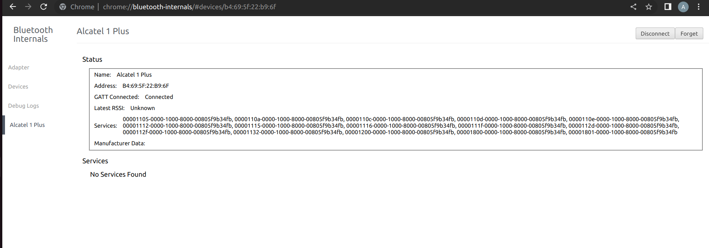
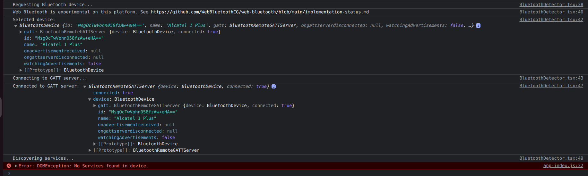
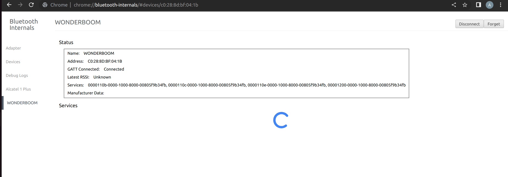
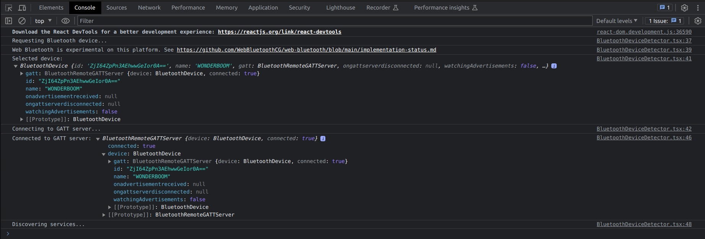

## Bluetooth Challenge

### Assignment:

```bash
1-Access through login: You can choose to use databases,user registration/modification,
or even login with Gmail, among other options.

2-Once inside, the site must have the ability to communicate with a Bluetooth
device of your choice to send or receive data, choose the way in which you view the information, and other options that you consider pertinent.
```

### What I've ran into:

#### With my phone

No services found

## 



#### With my speaker

spin

## 



### What I've done

```bash
Built the login and tried several ways to access the primaryServices from the devices.

First I tried @abandonware/noble library, to interact with BLE through node.js. X

Went for something more simple and tried Web Bluetooth API on Chrome browser. X


After tried to access the gATT services through nRFConnect. X
```

### What I've learnt

```bash
Basic IoT knowledge and will go for more
```

### To Do

```bash
Grab a device that allows me to read and write data, then play with those binary's

```

### To Deploy

```bash
Create a .env.local file following the .env.local.example file


To enable the Web Bluetooth API, it is necessary to establish a secure connection using HTTPS.
In order to set up a secure local development environment, you will need to generate a valid
SSL certificate.

sudo apt install mkcert

In the root directory

mkcert localhost

yarn dev
```
